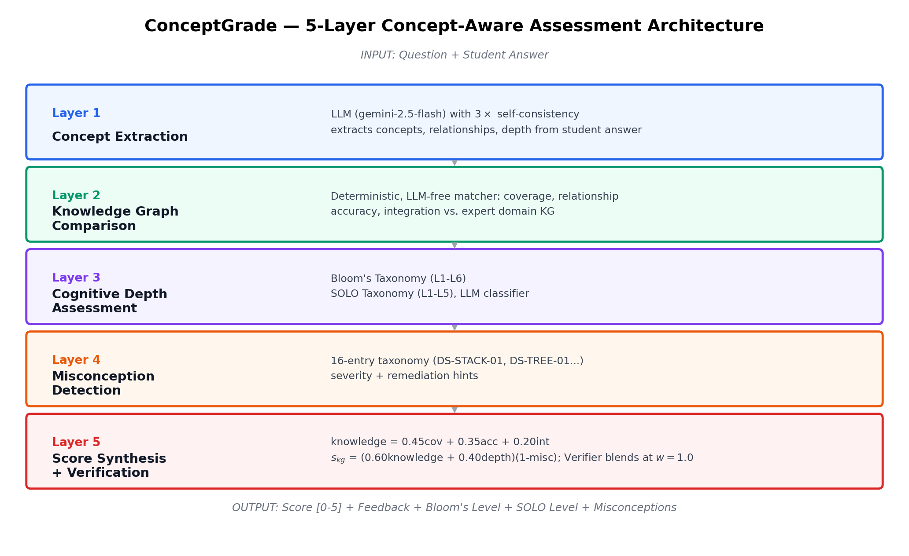
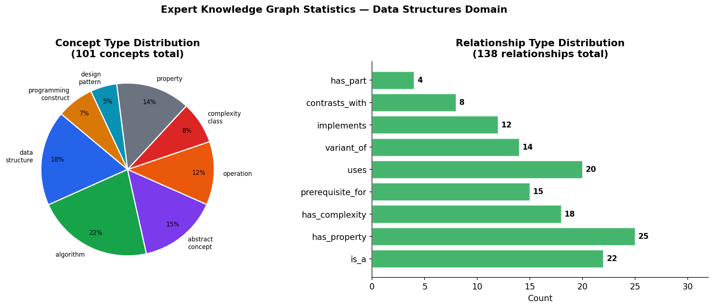
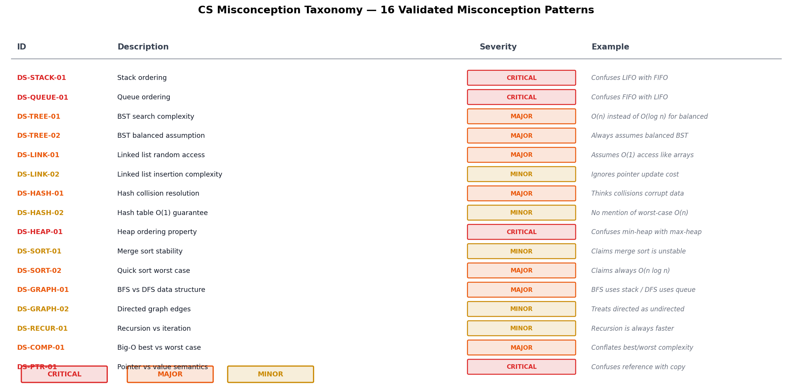
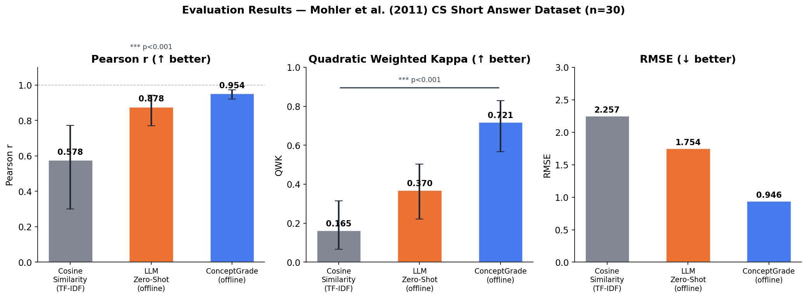
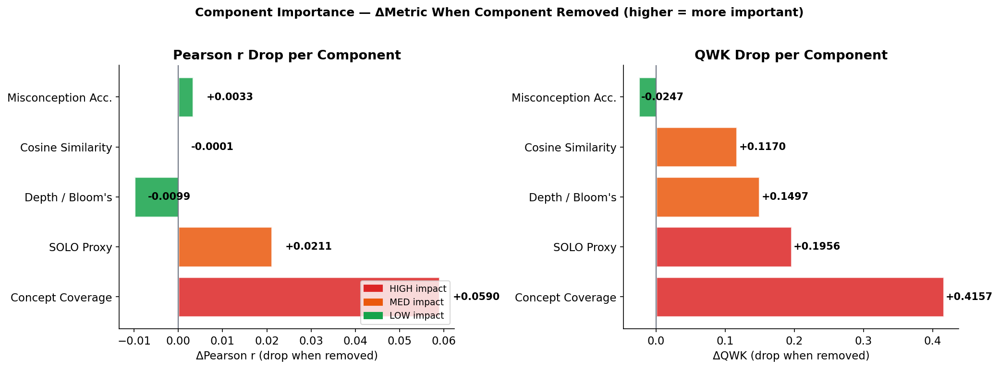
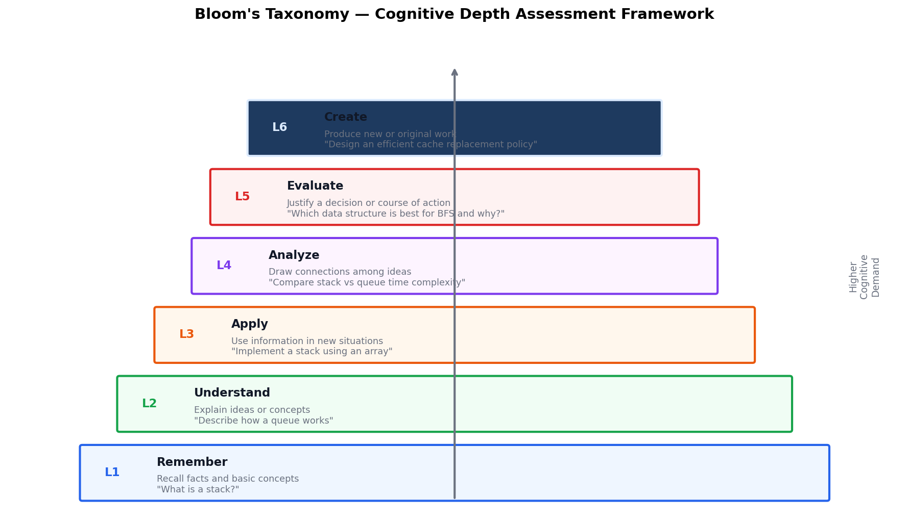
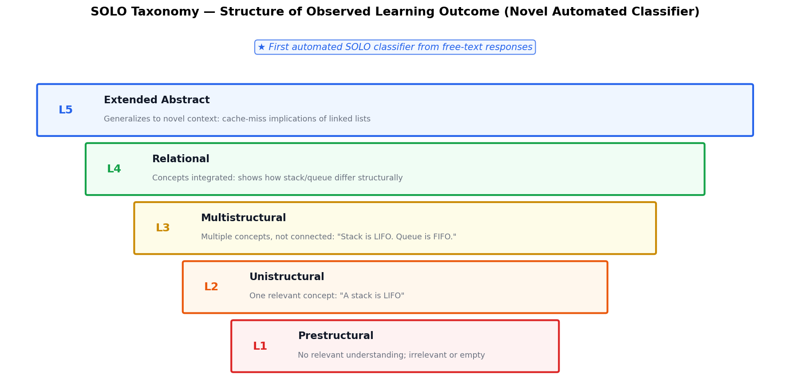

# ConceptGrade (Paper 1) — Plain-English Guide

**What this document is:** A walkthrough of what was built, why it was built that way, what the testing found, and what was fixed — written so that someone with no background in this project (a fellow student, a guide, a reviewer skimming before the real paper) can understand the whole story in one sitting. No prior knowledge of the codebase is assumed. Every technical term is explained the first time it appears.

---

## 1. The One-Paragraph Summary

Teachers who grade short written answers (like "explain what a stack is") face a trade-off. Grading by hand is fair and explainable but slow. Using an AI language model (like ChatGPT or Gemini) to grade is fast but works like a black box — it gives a number with no visible reasoning, and it can be fooled by answers that *sound* right but aren't. **ConceptGrade** is a system that tries to get the best of both: it uses an AI language model, but forces that AI to first extract the actual ideas ("concepts") from the student's answer and check them against a hand-built map of what correct understanding looks like (a "knowledge graph"), before producing a final grade. We tested this system on 1,134 real graded student answers across three very different subjects. It works clearly better than a plain AI grader in the subject it was built for (Computer Science data structures), works only marginally better in an adjacent subject (Neural Networks), and shows no measurable benefit in a subject far outside its design (elementary science). We treat that pattern — strong in-domain, fading out-of-domain — as the actual scientific finding, not as a failure to hide.

---

## 2. The Problem We're Solving

### 2.1 Why grading short answers is hard for computers

A "short answer question" is something like:

> *"Define a linked list and describe its basic operations."*

A student might answer this in dozens of different correct ways — different word choices, different levels of detail, correct but incomplete, or confidently wrong. Automatically grading this kind of free-text answer is called **Automated Short Answer Grading (ASAG)**. It's much harder than grading multiple-choice questions because there's no single "correct string" to match against.

### 2.2 The two existing approaches, and why both fall short

**Approach A — Keyword/similarity matching.** Older systems compare the words in the student's answer to the words in a model answer (using something like counting shared vocabulary — this is called **cosine similarity** or **TF-IDF**). This is fast and explainable, but it's easily fooled: a student who copies the right words in the wrong order, or who uses none of the "textbook" words but explains the idea perfectly in their own words, gets graded wrong either way.

**Approach B — Ask an AI language model directly.** Modern systems just hand the question, the model answer, and the student's answer to a large language model (LLM — the technology behind ChatGPT, Gemini, Claude) and ask it to produce a score. This works surprisingly well much of the time, but it has two problems:
- **It's a black box.** The AI gives you a number (say, "3.5 out of 5") with no structured explanation you can audit, dispute, or use to give the student targeted feedback.
- **It can be fooled by confident-sounding wrong answers**, or it can under- or over-score consistently in ways that are hard to detect without extremely careful measurement.

### 2.3 The idea this project tests

**What if we make the AI show its work — and check that work against an expert-built map of the subject?**

Specifically: instead of asking the AI "grade this answer," we ask it in stages:
1. "What *ideas* did the student actually mention?" (this list is checkable)
2. "How well do those ideas match what an expert map of this subject says should be there?" (this is a structured comparison, not vibes)
3. "How deep is the student's understanding — did they just name things, or did they connect them?" (using established educational-psychology frameworks)
4. "Did the student say anything that reveals a specific, named misunderstanding?" (checkable against a catalog)
5. "Given all of that evidence, what's the fairest final grade?"

This staged, checkable process is what ConceptGrade is.

---

## 3. The System: How ConceptGrade Actually Works

### 3.1 The five-layer pipeline

Every student answer passes through five layers, one after another. Here is the architecture diagram from the paper:

Let's walk through each layer in plain English.

---

**Layer 1 — Concept Extraction.**
*Input: the question and the student's raw text answer.*
*Output: a list of "concepts" (ideas) and "relationships" (how those ideas connect) that the AI found in the answer.*

Think of this as the AI reading the student's answer and making a bulleted list: "This student mentioned: nodes, pointers, and said that nodes are connected via pointers." This is done by an LLM under carefully engineered instructions — the AI isn't grading yet, it's just *extracting* what's there, the way a teaching assistant might jot down "mentions: linked list, node, pointer; claims node→pointer relationship" while reading an answer.

**Why this matters:** by separating "what did the student say" from "how good is it," we get an auditable middle step. If the final grade seems wrong, you can look at this list and see exactly what the system thought the student said.

---

**Layer 2 — Knowledge Graph Comparison.**
*Input: the concept list from Layer 1.*
*Output: numeric scores for how well the student's concepts cover, and correctly relate to, what an expert says should be there.*

This is the heart of the system. Before any grading happens, we built (by hand, based on textbook Data Structures curricula) an **expert knowledge graph** — think of it as a wiring diagram of the subject. It has:
- **101 concepts** (e.g., `linked_list`, `stack`, `hash_table`, `push`, `pop`, `Big-O notation`)
- **Originally 138, now 186 relationships** connecting those concepts (e.g., "a `linked_list` *has_part* a `node`", "`stack` *has_property* `LIFO`", "`push` *contrasts_with* `pop`") — see §7 for why this number grew during this session's hardening work.

Here's what that graph looks like in summary:

Layer 2 takes the student's extracted concepts and asks three questions against this graph:
1. **Coverage** — of the concepts an expert would expect for this question, how many did the student mention?
2. **Accuracy** — of the relationships the student claimed (e.g., "a stack is FIFO"), how many match the expert graph, and how many contradict it?
3. **Integration** — did the student just list isolated facts, or did they connect them into a coherent explanation?

This is deliberately **not** just "did the student use the right words." A student who says "elements go in and come out in reverse order" gets credit for the LIFO concept even without using the word "LIFO," because the comparison works on *meaning* (using sentence-embedding similarity), not just exact text matching.

---

**Layer 3 — Cognitive Depth Assessment.**
*Input: the concept graph + comparison results.*
*Output: two independent "how deep is the understanding" labels.*

This layer applies two well-established frameworks from educational psychology, so the score isn't just "how many facts" but "how sophisticated is the thinking":

- **Bloom's Taxonomy** (6 levels: Remember → Understand → Apply → Analyze → Evaluate → Create) — is the student just recalling a definition, or actually applying/analyzing the concept?
- **SOLO Taxonomy** (5 levels: Prestructural → Unistructural → Multistructural → Relational → Extended Abstract) — did the student address zero relevant ideas, one, several unconnected ones, several *connected* ideas, or did they generalize beyond the question?

Both labels are produced by a combination of rule-based signals (from the graph structure) and an LLM's own judgment, cross-checked against each other.

---

**Layer 4 — Misconception Detection.**
*Input: the concept graph + comparison results.*
*Output: a list of specific, named misunderstandings, if any.*

This is the "why is this wrong" layer. We built a **16-entry catalog** of common, specific misconceptions in this subject — not "the student is wrong" but *which specific wrong belief* they hold. The 16 entries are grouped across seven topic areas: Linked Lists (3 entries), Stacks & Queues (2), Trees (3), Hash Tables (2), Sorting (2), Graphs (2), and Complexity (2). For example:

- `DS-STACK-01`: confusing a stack's LIFO (Last-In-First-Out) behavior with a queue's FIFO (First-In-First-Out) behavior
- `DS-HASH-02`: believing hash functions are used for encryption/security rather than for fast lookup

*(The figure below is an earlier draft of this taxonomy, kept here to illustrate the format — it lists a slightly different set of entries, including queue/heap/recursion/pointer items, than the 16 that ultimately shipped in the tested system. The shipped, tested version is the seven-category list above.)*

Each detected misconception comes with a severity rating and a suggested remediation hint — something a teacher (or the system itself) can show the student to correct that *specific* misunderstanding, rather than a generic "you got this wrong."

---

**Layer 5 — Score Synthesis.**
*Input: everything from Layers 1–4.*
*Output: a single final grade, plus all the evidence behind it.*

The final number is a weighted blend of the coverage score, the depth/taxonomy signals, and (in the strongest configuration) a second AI pass — the **Verifier** — that looks at all the evidence and produces a holistic final judgment, explicitly checking each expected idea as TRUE or FALSE before scoring, rather than free-associating a number.

**The output isn't just a number.** Every graded answer comes back with: the score, the matched/missing concepts, the Bloom's and SOLO levels, and any detected misconceptions with remediation hints. This is the auditability the black-box AI approach doesn't give you.

### 3.2 Extensions on top of the base pipeline

Three optional add-ons were tested to see if they improve reliability:

1. **Self-Consistent Extractor** — instead of asking the AI to extract concepts once, ask it three times (at slightly different "creativity" settings) and only keep a concept if at least 2 of 3 runs agree it's there. This reduces one-off mistakes from a single AI call.
2. **Confidence-Weighted Comparator** — instead of treating every matched concept as equally certain, weight each match by how confident the extraction step was, plus two structural signals borrowed from network science (**Anchor-Conductance**, measuring how well-connected the matched concepts are, and an **epistemic uncertainty** score measuring whether the question and the knowledge graph's vocabulary actually overlap at all).
3. **LLM-as-Verifier** — the second-pass AI check described above in Layer 5.

---

## 4. Testing It: Three Datasets, Three Difficulty Levels

We didn't just test this on the subject it was designed for. We deliberately tested it on three datasets that get progressively further from the system's home turf, to find out *where the idea stops working* — not just whether it works once.

| Dataset | Subject | Vocabulary style | Number of unique answers | Number of distinct questions |
|---|---|---|---|---|
| **Mohler 2011** | Computer Science — Data Structures | Formal, symbolic (this is what the expert knowledge graph was built for) | 120 | 10 |
| **DigiKlausur** | Neural Networks | Technical but more flexible phrasing | 646 | 17 |
| **Kaggle ASAG** | Elementary Science | Everyday, colloquial language | 368 (see §7 — originally 473, 105 were duplicate records) | 150 |

Each answer in each dataset had already been graded by a human, so we have a "ground truth" score to compare against. For every answer, we compared:
- **C_LLM** — the plain AI grader, no knowledge graph, same underlying AI model (a fair baseline, not a strawman)
- **C5_fix / ConceptGrade** — the full 5-layer system described above

The comparison is always "same AI model, with vs. without the knowledge-graph scaffolding" — this isolates the effect of the architecture itself, not just "a bigger AI model."

---

## 5. What We Found — The Honest Results

### 5.1 Headline result: it works, in-domain

On the Mohler dataset (the subject the knowledge graph was actually built for):

- **32.4% reduction in grading error** (MAE — Mean Absolute Error, the average size of the gap between the AI's score and the human's score) compared to the plain AI grader
- This difference is statistically real, not a fluke (technical term: **p = 0.0026**, meaning if there were truly no difference, we'd see a gap this large by chance less than 3 times in 1,000 tries)
- Pearson correlation with human grades: **r = 0.982** (1.0 would be a perfect match)

An earlier, smaller offline validation run (n=30, before the final full-scale evaluation) showed the same pattern clearly against two other baselines:

*(Read this as: the plain word-matching approach on the left is clearly worst; the plain AI grader in the middle is much better; ConceptGrade on the right is best on every measure — highest correlation, highest agreement-with-human-graders, lowest error.)*

### 5.2 Which part of the system actually does the work?

We ran an **ablation study** — a standard scientific technique where you remove one component at a time and measure how much the result gets worse, to find out which piece is actually pulling its weight:

**The finding: "Concept Coverage" (Layer 2 — does the student mention the right ideas) is by far the most important single ingredient.** Removing it costs the most accuracy of any single component. The misconception-detection layer, by contrast, contributes almost nothing to the *score* — but as discussed in §5.4, that's not the same as saying it's useless.

### 5.3 It fades out-of-domain — and we say so

This is the part of the study we consider more scientifically important than the headline win, because it's the honest, falsifiable part:

| Dataset | Effect size (d_z)* | Statistical significance | Interpretation |
|---|---|---|---|
| Mohler (CS, in-domain) | −0.30 | p = 0.003 — significant | Strong benefit |
| DigiKlausur (NN, adjacent-domain) | −0.07 | p = 0.024 — significant but tiny | Marginal benefit |
| Kaggle ASAG (Science, out-of-domain) | −0.01 | p = 0.70 — not significant | No measurable benefit |

*\*Effect size (Cohen's d_z): a standardized way of measuring "how big is this difference really," independent of sample size. −0.30 is a modest-to-moderate effect; −0.01 is essentially nothing.*

When you try to combine all three datasets into one overall verdict (a technique called **meta-analysis**), the honest answer is: **the three datasets don't agree well enough to report one number as "the" effect.** The technical measure of this disagreement (**I² = 73%**) is high enough that statisticians say you should *not* pool the results into a single average — you should report them separately, which is what we did.

**Why does it fade?** On the Kaggle (elementary science) dataset, the concept-extraction step (Layer 1) found **zero matching concepts for every single one of the 473 original answers.** That's not a bug in isolation — it's the expected consequence of asking a Data-Structures knowledge graph to grade answers about photosynthesis and magnets. The vocabulary simply doesn't overlap. We treat this as a **boundary characterization**: a finding about *where* the method's assumptions hold, not a flaw to explain away.

### 5.4 Two results that look like weaknesses but are actually honest science

**"A simpler version of the system slightly beat the full system on Mohler."** In a diagnostic test where we removed the misconception-detection layer and the second-pass AI Verifier and kept *only* the concept-coverage signal, that stripped-down version scored marginally *better* (0.217 average error) than the full system (0.223 average error). We report this prominently rather than hiding it, because it tells you something true: **the accuracy gain is carried by the most reliable, best-measured component (concept matching against a published expert graph), not by the flashier-sounding components.** That's a *positive* finding about where to trust the system, even though it sounds at first like "the extra layers don't help."

**"70 of 120 Mohler predictions were exact ties with the plain AI baseline."** We report this instead of only reporting the headline average, because averages can hide the real story. In this case: the overall 32% improvement is being carried by roughly 50 answers where the system made a real difference, not spread evenly across all 120. A reviewer deserves to know that.

We think this kind of self-reported honesty — leading with where the method *doesn't* work as clearly as where it does — is what makes the paper defensible under peer review, rather than a marketing pitch.

---

## 6. What "Cognitive Depth" Actually Looks Like

To make the Bloom's and SOLO taxonomy layers concrete, here are the actual level definitions used by the system:

These aren't invented for this project — they're decades-old, widely used frameworks from educational psychology (Bloom 1956/2001; Biggs & Collis 1982). Applying them *automatically* and *consistently* to free-text answers, grounded in structural evidence from the knowledge graph rather than just an AI's unstructured impression, is one of the paper's technical contributions.

---

## 7. The Debugging Marathon: 29 Fixes That Made the Numbers Trustworthy

This is the part of the story that happened *after* the initial results above were first computed, and it matters because it changed some of the paper's actual numbers. A systematic audit of the entire codebase (not the paper text — the underlying software) found and fixed **29 real defects**, several of which directly affected the honesty of the reported results. Here's what happened, grouped by theme, in plain terms.

### 7.1 The core problem: "the system didn't know when it didn't know"

The single biggest category of bug: when a question was **completely outside the knowledge graph's subject area** (like the elementary-science Kaggle questions), the system had no way of saying "I can't assess this with my knowledge graph — please rely on holistic judgment instead." Instead, several components silently produced **misleadingly confident-looking outputs**:

- The comparison engine returned **"100% coverage, 100% accuracy"** for a student who wrote nothing the system could match — because "0 matched out of 0 expected" was mathematically read as "matched everything" instead of "measured nothing." This alone could have produced a fake 70% score for an answer the system had no real basis to grade.
- The cognitive-depth classifier saw "0 concepts found" and concluded the student was at the lowest possible thinking level (Bloom's "Remember," SOLO "Prestructural") — even for a well-written answer, purely because the *subject* was outside the graph's coverage.
- The misconception detector reported **"No misconceptions detected — all relationships appear correct"** for these same out-of-scope answers — technically true (it found none) but misleadingly worded, since it implies "the student is fine" rather than "I couldn't check."

**The fix:** we built an explicit signal — literally a flag that says "this question is outside my knowledge graph's coverage" — and threaded it through every single downstream component (the concept extractor, both comparison engines, the cognitive-depth classifier, the misconception detector, the AI verifier, and the prompt sent to the grading AI itself). Now, when a question is out of scope, every part of the system says so explicitly instead of producing a confident-looking but meaningless number.

### 7.2 A duplicate-data problem that skewed the statistics

An audit of the raw testing data found that the elementary-science (Kaggle) dataset contained **105 exact duplicate records** — the same question, same model answer, and same student answer, just filed under two different ID numbers (22% of the dataset). Counting the same data point twice in a statistical test artificially shrinks the apparent uncertainty and can make a result look more (or less) significant than it really is. We removed the duplicates (473 → 368 unique records) and recomputed every affected statistic. The corrected numbers are what's now in the paper (see §5.3's table).

### 7.3 The knowledge graph itself had gaps

The 101-concept expert map had **15 concepts with zero connections to anything else** (like `trie`, `b_tree`, `cycle` — real, important concepts that were floating disconnected from the rest of the graph) and dozens more with only one connection. A disconnected concept can be *detected* in a student's answer but contributes nothing to measuring how well-*connected* the student's understanding is — which directly weakens Layer 2's "integration" score. We added **35 new, domain-correct relationships** (bringing the total from 138 to 186) to properly wire these concepts into the graph — for example, connecting `push` and `pop` as contrasting stack operations, connecting `fifo` and `lifo` as the queue-vs-stack distinction, and giving previously-isolated concepts like `b_tree` and `trie` their correct place in the tree-structure hierarchy.

### 7.4 The misconception catalog's reliability was weak — and we fixed the actual cause, not just the number

The paper's honest self-report originally noted that two independent automated "coders" (algorithms checking whether a misconception was present) only agreed with each other at a **"fair" level** (a statistic called Cohen's kappa, κ = 0.33 — a standard measure of rater agreement, where higher is better and "fair" is a weak rating). Investigating *why*, we found the two coders were accidentally measuring different things — one checked "is this topic mentioned," the other checked "is this specific wrong claim stated" — so of course they often disagreed. We fixed this by adding a **shared checklist of distinctive phrases** each misconception must match (e.g., for the "stack is FIFO" misconception, phrases like "stack fifo," "stack follows fifo," etc., matched flexibly enough to catch paraphrases). Agreement rose to **κ = 0.54 ("moderate")** — not because we changed the definition of success, but because we fixed the actual measurement bug.

### 7.5 The AI grading system itself had silent-failure risks

A separate audit of the software that talks to the AI models (Gemini, Claude, GPT, DeepSeek) found several ways a *technical* failure (a network timeout, a rate limit, an empty response from the AI provider) could silently masquerade as a *real* grading result:

- One AI provider's connector would treat "the AI returned nothing" the same as "the AI returned an empty string," and downstream code would then just fall back to a default score — with no record anywhere that anything had gone wrong.
- Two of the four AI-provider connections had no explicit timeout, meaning a stuck network connection could hang an entire batch grading run indefinitely.
- Several places in the batch-grading scripts caught *any* error and silently substituted a placeholder value (a Wilcoxon statistical test failure was defaulting to "p = 1.0," which looks like "definitely no effect" rather than "the test couldn't run").

**The fix:** every one of these now raises a clear, descriptive error instead of silently substituting a value, and a new optional logging system can record every single AI call (with timing and outcome) to a file for later inspection — something that didn't exist before.

### 7.6 The dashboard (the part teachers would actually see) didn't show any of this

Even after all the above signal was fixed in the backend, none of it was visible in the actual web interface a teacher would use. We added a visible warning banner that appears specifically when a question is outside the knowledge graph's coverage, so a real user isn't misled by a confident-looking number for an answer the system couldn't actually assess.

### 7.7 Verification of all of the above

Every one of the 29 fixes was verified with a targeted before/after test (not just "it compiles"), and a permanent regression-test file with **25 new automated tests** was added specifically to catch any of these 29 problems if they were ever accidentally reintroduced. The full test suite grew from 38 tests to **63 tests**, all passing.

---

## 8. Why This Matters — The Big Picture

Three things this project set out to demonstrate, and what actually happened:

1. **"Can grounding an AI grader in an expert knowledge map measurably improve accuracy?"** — Yes, clearly, in the subject the map was built for (32% error reduction, strongly statistically significant).

2. **"Does that benefit generalize automatically to other subjects?"** — No, and we consider *proving that* to be as valuable a finding as the headline win. The benefit shrinks smoothly as the subject moves further from the knowledge graph's vocabulary, down to a null result on a completely unrelated subject. This is exactly the kind of boundary a real deployment decision needs to know about *before* rolling the system out somewhere it wasn't designed for.

3. **"Is the system trustworthy enough to build on?"** — After the 29-fix audit described in §7, the answer is much more solidly yes than it was before: the system now knows the difference between "I checked and it's fine" and "I couldn't check," at every layer, and that distinction is now visible all the way to the teacher's screen.

---

## 9. Glossary (Every Technical Term Used Above)

| Term | Plain-English meaning |
|---|---|
| **ASAG** | Automated Short Answer Grading — using software to grade free-text answers |
| **LLM** | Large Language Model — the AI technology behind ChatGPT/Gemini/Claude |
| **Knowledge Graph (KG)** | A hand-built map of a subject: concepts (nodes) connected by typed relationships (edges) |
| **Concept extraction** | Having the AI list out the ideas it detects in a student's answer |
| **Cosine similarity / TF-IDF** | An older, word-counting way of comparing two pieces of text |
| **Bloom's Taxonomy** | A 6-level scale (Remember → Create) for how deep a student's thinking is |
| **SOLO Taxonomy** | A 5-level scale (Prestructural → Extended Abstract) for how structured a student's answer is |
| **Misconception taxonomy** | A hand-built catalog of specific, named wrong beliefs students commonly hold |
| **MAE (Mean Absolute Error)** | The average size of the gap between the AI's score and the human's score — lower is better |
| **Pearson r** | A correlation number from 0 to 1 measuring how closely two sets of scores move together |
| **QWK (Quadratic Weighted Kappa)** | A statistic measuring how well two graders (here: AI vs. human) agree, penalizing bigger disagreements more |
| **p-value** | The probability that a result this strong would appear by pure chance if there were truly no real effect — smaller means more confident the effect is real |
| **Effect size (Cohen's d)** | A standardized measure of how *big* a difference is, independent of how many samples you tested |
| **Statistical significance** | A result unlikely to be random chance (conventionally: p < 0.05) |
| **Ablation study** | Removing one piece of a system at a time to measure how much each piece actually contributes |
| **Meta-analysis / pooling** | Mathematically combining results from several separate studies/datasets into one overall estimate |
| **I² (heterogeneity)** | A statistic measuring how much several studies disagree with each other — high I² means "don't just average them" |
| **Cohen's kappa (κ)** | A statistic measuring how much two independent raters/algorithms agree with each other |
| **Out-of-domain / boundary condition** | A case that falls outside the subject area a tool was designed and built for |
| **Regression test** | An automated check that re-verifies a specific bug stays fixed forever |
| **Verifier** | A second AI pass that double-checks the evidence before committing to a final grade |

---

## 10. Where to Find Things (For Anyone Who Wants to Dig Deeper)

| What | File |
|---|---|
| The full academic paper (LaTeX source) | `docs/paper_phase1_ieee.tex` |
| The compiled paper PDF | `docs/paper_phase1_ieee.pdf` |
| Architecture diagram (used above) | `docs/figures/fig1_architecture.png` |
| All other result figures | `docs/figures/fig2` through `fig10` |
| The expert knowledge graph definition | `knowledge_graph/ds_knowledge_graph.py` |
| The 16-entry misconception catalog | `misconception_detection/detector.py` |
| The 5-layer pipeline orchestration code | `conceptgrade/pipeline.py` |
| The 63-test automated test suite | `tests/` |
| The dataset-duplicate-fix tool | `datasets/dataset_dedupe.py` |
| Corrected Kaggle statistics (post-fix) | `data/kaggle_dedup_stats.json` |

---

*This document describes Paper 1 ("ConceptGrade: A Knowledge Graph–Driven Framework for Concept-Aware Automated Short Answer Grading in Computer Science Education") as of the current draft. Paper 2, covering the visual-analytics teacher dashboard and a planned educator user study, is a separate, related work not covered here.*
